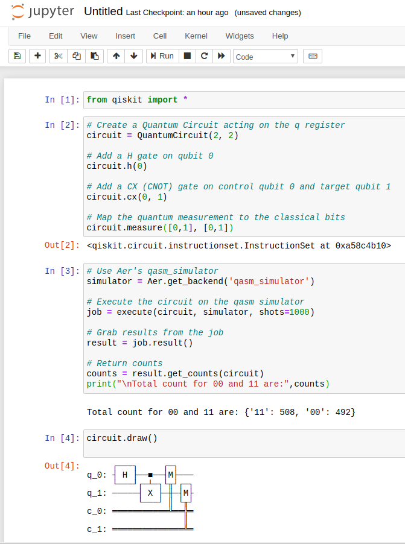

# qiskit-pi

This contains a Dockerfile that builds a docker image for IBM's [qiskit](https://qiskit.org/) Quantum Computing framework on a Raspberry Pi.

A pre-built image is available on Docker Hub as `romilly/quiskit-pi`.

## Alternatives!

You may prefer to install qiskit on the Pi in a virtual environment.

As of 1 June 2020 the installation took under an hour and a half on an 8GB Pi 4 running Raspberry Pi OS.

It requires you to install the rust nightly build, so it takes up a fair amount of space.
You can uninstall rust after pip has installed `retowrkx`.

I've saved a copy of the history of a successful installation in virtual-qiskit.txt in this repository so you can repeat it if you prefer.

## Warning

I've had to pin an old build of pyscf (1.4.5) in both builds as the current version does not build on pywheels
and I cannot get it to install locally. This may mean that some of the packages in quiskit-aqua are broken, though a few manual tests have passed.

## License

Both qiskit and this work are covered by the [Apache License 2.0](LICENSE.txt)

You can find [qiskit on GitHib](https://github.com/Qiskit/qiskit)

## Example

